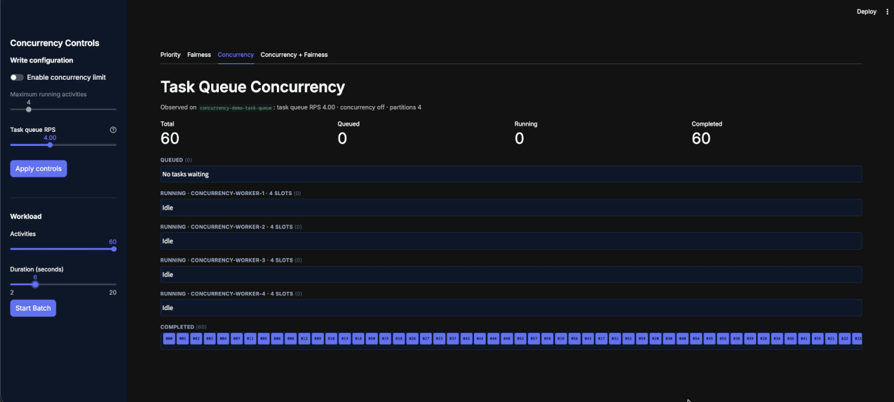

# Priority, Fairness & Concurrency Demo

Interactive Streamlit demos of Temporal task queue priority, Fairness, and queue-wide concurrency.

## Feature status

- **Priority and Fairness are generally available.** You can run those two tabs against a released local Temporal server. Docker and a custom server build are not required.
- **Task queue concurrency is experimental and is not yet in pre-release.** The two concurrency tabs require the bundled preview server, which is built from unreleased development commits. Use it only for this local demo, never for production workloads.


## Run priority and Fairness (GA)

Prerequisites:

- Python 3.12 or later
- [`uv`](https://docs.astral.sh/uv/)
- The [Temporal CLI](https://docs.temporal.io/cli)

Start a released local Temporal server with priority and Fairness enabled:

```bash
temporal server start-dev \
  --dynamic-config-value matching.useNewMatcher=true \
  --dynamic-config-value matching.enableFairness=true \
  --dynamic-config-value matching.numTaskqueueReadPartitions=1 \
  --dynamic-config-value matching.numTaskqueueWritePartitions=1
```

In another terminal, install the application and start the priority/Fairness worker:

```bash
uv sync
uv run python worker.py
```

In a third terminal, start the dashboard:

```bash
uv run streamlit run dashboard.py
```

Open [http://localhost:8501](http://localhost:8501) and use the **Priority** and **Fairness** tabs. The concurrency tabs will not work against the released server used by this setup.

## Run task queue concurrency (experimental)

> [!WARNING]
> Task queue concurrency is an experimental engineering snapshot, not a pre-release feature. This setup uses pinned, unreleased server and API code and must not be used for production workloads.



Stop any local Temporal server or Streamlit process using those ports, then run:

```bash
docker compose up --build
```

Compose builds the pinned preview server and the Python demo application locally, creates the `default` namespace, and starts the dashboard and all workers. The first server build can take several minutes; subsequent runs use Docker's build cache. Open [http://localhost:8501](http://localhost:8501); all four tabs are available in this setup.

The stack is isolated from Temporal Cloud. It connects directly to its own `temporal` container and does not read or modify Temporal CLI profiles.

Stop it when finished:

```bash
docker compose down
```

### Verify the experimental setup

With the Compose stack running, execute the end-to-end smoke test:

```bash
docker compose --profile test run --rm e2e
```

## What the dashboard shows

- **Concurrency (experimental)** — Runs one uniform workload of longer activities across four workers and four task queue partitions. Apply a server-side queue concurrency limit and observe the aggregate number of running activities across every worker and partition.
- **Concurrency + Fairness (experimental)** — Runs a multi-tenant workload on one partition. Fairness controls backlog dispatch order while the concurrency limit bounds the total number of running activities.

The concurrency tabs use separate task queues, so each has independent RPS and concurrency settings. Each concurrency task queue has four workers with four activity slots each, leaving 16 worker slots available for the server-side limit to control.
