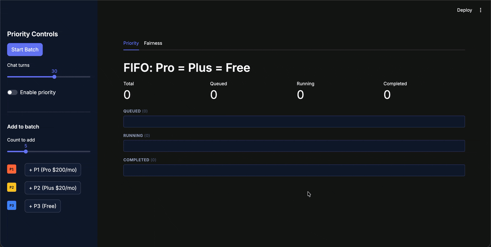

# Priority, Fairness & Concurrency Demo

Interactive Streamlit demo of Temporal task queue priority, Fairness, and queue-wide concurrency.

> [!WARNING]
> Task queue concurrency is an experimental preview. The bundled server is built from unreleased development commits and must not be used for production workloads.



## Run the complete demo

Prerequisites:

- Docker with Docker Compose
- Ports `7233`, `7243`, and `8501` available locally

Start the preview server, create the `default` namespace, and launch the dashboard and all workers:

```bash
docker compose up --build
```

The first build compiles the pinned Temporal server and can take several minutes. Subsequent builds use Docker's build cache.

Open [http://localhost:8501](http://localhost:8501), then stop the stack when finished:

```bash
docker compose down
```

The stack is isolated from Temporal Cloud. It connects directly to its own `temporal` container and does not read or modify Temporal CLI profiles.

## Verify the demo

With the stack running, execute the end-to-end smoke test:

```bash
docker compose --profile test run --rm e2e
```

The test verifies that:

- The dashboard is healthy.
- The concurrency task queue has four activity partitions.
- The concurrency + Fairness task queue has one activity partition.
- A real batch across four workers never exceeds a queue-wide concurrency limit of two.
- A real Fairness-keyed batch never exceeds a queue-wide concurrency limit of three.

## What the dashboard shows

The dashboard has four tabs:

**Priority** — Starts workflows with random priorities. With priority enabled, higher-priority work runs before lower-priority work; disabling it shows FIFO behavior.

**Fairness** — Starts a workload split across three tenants. With Fairness enabled, all tenants receive regular turns; disabling it shows how a large tenant can dominate the backlog.

**Concurrency** — Runs one uniform workload of longer activities across four workers and four task queue partitions. Apply a server-side queue concurrency limit and observe the aggregate number of running activities across every worker and partition.

**Concurrency + Fairness** — Runs a multi-tenant workload on one partition. Fairness controls backlog dispatch order while the concurrency limit bounds the total number of running activities.

The concurrency tabs use separate task queues, so each has independent RPS and concurrency settings.

## Preview server provenance

The preview image is built reproducibly by [`preview/server.Dockerfile`](preview/server.Dockerfile) from these immutable inputs:

- Temporal server: [`dnr/temporal@0d77be1f0`](https://github.com/dnr/temporal/commit/0d77be1f0b2531d1bc14228a45e18636e9d3c100)
- Temporal API: [`dnr/api@8615aa7`](https://github.com/dnr/api/commit/8615aa77180cfbe1ed1413c0f67579100d1c739c)
- Go API baseline: [`temporalio/api-go@e54fd69`](https://github.com/temporalio/api-go/commit/e54fd69950e119eaf0df6d31dfa795467e66f910)
- Go protobuf generator: `v1.36.10`

The API work is tracked in [temporalio/api#852](https://github.com/temporalio/api/pull/852). The Docker build generates the two required Go API files itself; it does not depend on a sibling checkout or uncommitted generated code.

The demo configuration enables priority and Fairness globally, keeps the default four partitions for the concurrency queue, and constrains only `concurrency-fairness-demo-task-queue` to one partition.

## Run the Python application against an existing preview server

For application development without Compose:

```bash
uv sync
uv run python bootstrap.py
uv run python demo_workers.py
uv run streamlit run dashboard.py
```

The defaults connect to gRPC at `127.0.0.1:7233`, HTTP at `127.0.0.1:7243`, and namespace `default`. Override them only when needed:

```bash
export TEMPORAL_DEMO_ADDRESS=127.0.0.1:7233
export TEMPORAL_DEMO_HTTP_ADDRESS=http://127.0.0.1:7243
export TEMPORAL_DEMO_NAMESPACE=default
```

The original priority/Fairness worker has one activity slot to make ordering visible. Each concurrency task queue has four independently identified workers with four activity slots each, leaving 16 worker slots available for the server-side limit to control.
